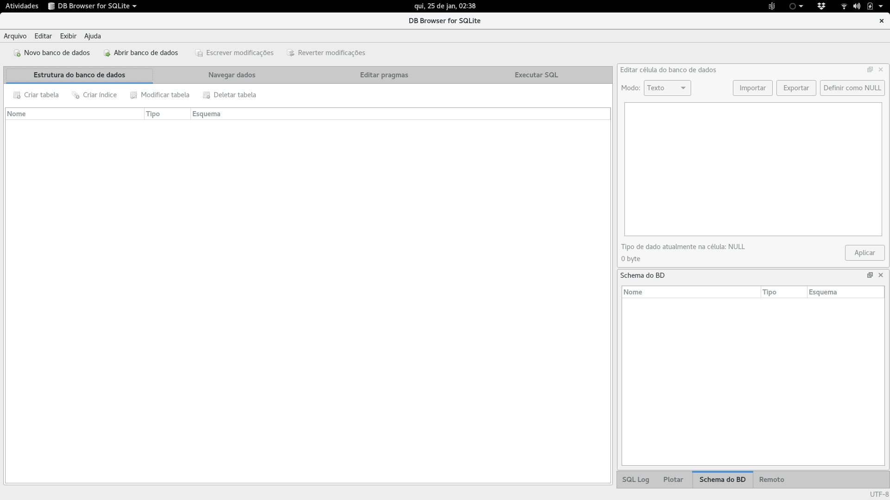
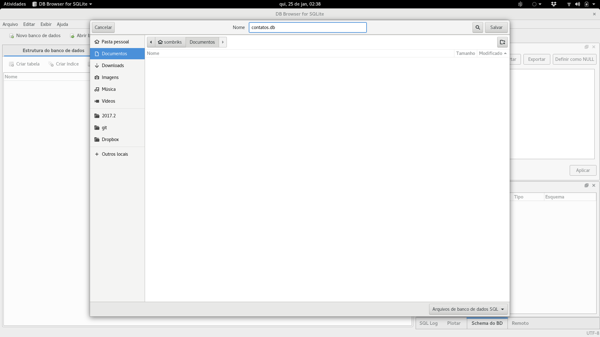
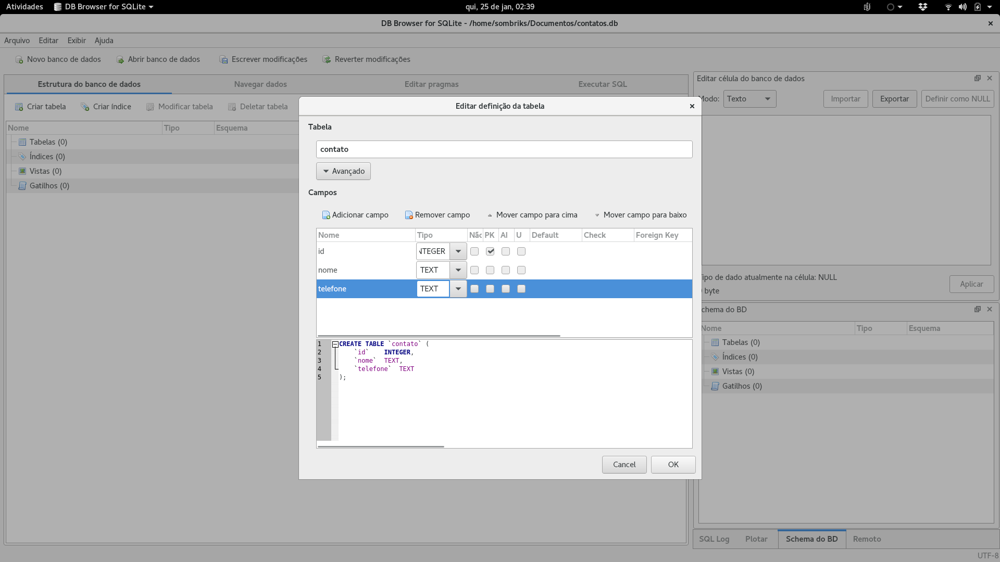
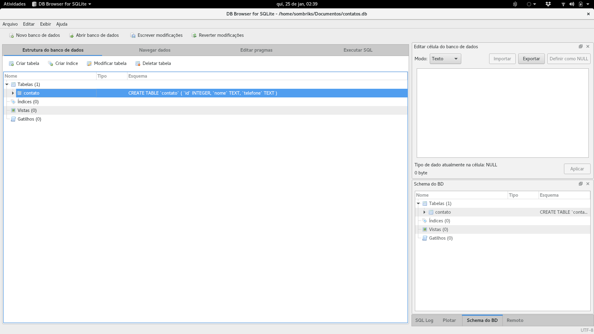
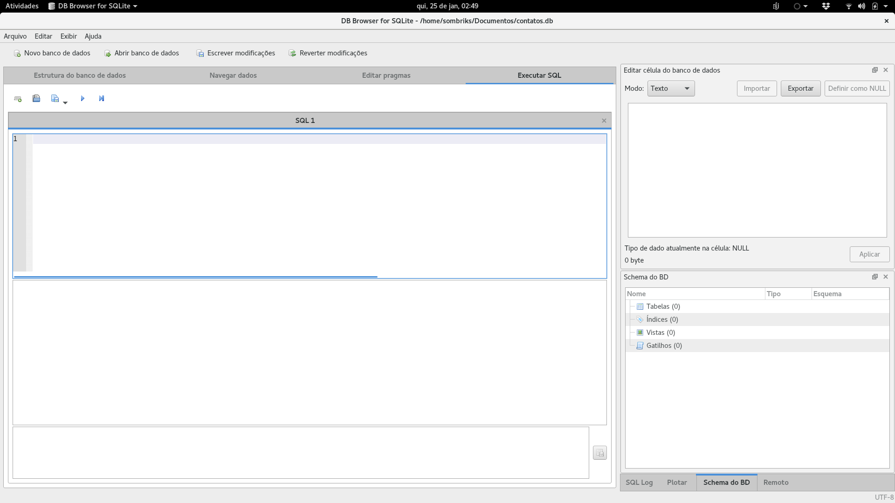

# Parte 4

Precisamos persistir dados em uma base de dados relacional.

## SQLite / dbbrowser

- Para podermos treinar SQL, precisaremos de um SGBD
- O mais didático de todos é o [SQLite](https://sqlite.org/)
- Para administrarmos os dados do banco, usaremos uma ferramenta gráfica
- [db browser](http://sqlitebrowser.org/)

### Uso básico

- Abra o db browser



- Aperte em "Novo banco de dados" e salve com um nome apropriado 
  (ex: *contatos.db*)



- Um 'assistente' de criação de tabelas eventualmente abrirá. É seguro ignorar
  ele por enquanto



- A situação atual do esquema será apresentada. Não tem muita coisa pra ver,
  ao menos por hora



- Importante: nunca esquecer de "Escrever modificações", pois sem isso os 
  dados não constarão no arquivo do banco


- Por fim, selecione a aba "Executar SQL"



### Outros SGBD's

- [PostgreSQL](https://www.postgresql.org/)
- [MySQL](https://www.mysql.com/)
- [Oracle](http://www.oracle.com/technetwork/database/enterprise-edition/downloads/index.html)
- [DB2](https://www.ibm.com/analytics/us/en/db2/trials/)
- [H2](http://www.h2database.com/html/main.html) 
- [SQLServer](https://www.microsoft.com/pt-br/sql-server/sql-server-downloads)

*"Qual é o melhor?"*

## SQL

- Structured Query Language
- Baseado na Algebra Relacional (matemática, meu chapa!)
- Bom para produzir informação em cima de uma massa de dados 
- ACID (Atomicidade, Consistência, Isolamento e Durabilidade)

Podemos dividir o SQL em DDL e DML

### Data Definition Language

- Podemos criar tabelas

```sql
-- script-1.sql
create table contato(
  idcontato integer not null primary key autoincrement,
  nomecontato varchar(255) not null,
  datacriacaocontato timestamp not null default current_timestamp
);
```

- Podemos adicionar colunas em tabelas existentes

```sql
-- script-2.sql
alter table contato add column telefonecontato varchar(255);
```

- Podemos excluir tabelas

```sql
-- script-3.sql
drop table contato;
```

- O sqlite possui limitações, mas outros bancos permitem *modificar* colunas, 
  *remover* colunas e/ou restrições. 

#### Chave primária e chave estrangeira

- O ID de uma determinada entidade (ler o 
  [paradoxo do navio de teseu](https://pt.wikipedia.org/wiki/Navio_de_Teseu#O_paradoxo)) 
  diferencia de modo absoluto uma da outra
- Entidades distintas podem se relacionar, então uma entidade guarda a chave da
  outra em uma de suas colunas

Exemplo:

```sql
-- script-4.sql
create table modelo(
  idmodelo integer not null primary key autoincrement,
  descricaomodelo varchar(255) not null 
);

create table carro (
  idcarro integer not null primary key autoincrement,
  placa varchar(255) not null,
  idmodelo integer not null,
  foreign key (idmodelo) references modelo(idmodelo) 
);
```

Relacionamento **1:N** *(um para N)*
Uma forma de ler isso é: *existem vários modelosde carro, mas um carro possui*
*apenas um modelo*

Outro Exemplo:

```sql
-- script-4.sql
create table festa(
  idfesta integer not null primary key autoincrement
  -- demais campos
);

create table convidado (
  idconvidado integer not null primary key autoincrement
  -- demais campos
);

create table festa_convidado (
  idfesta integer not null,
  idconvidado integer not null,
  foreign key (idfesta) references festa(idfesta),
  foreign key (idconvidado) references convidado(idconvidado),
  primary key (idfesta,idconvidado)
);
```

Relacionamento **N:N** *(N para N)*
*Vários convidados podem participar de várias festas*
*Mas um convidado pode participar de uma determinada festa uma única vez*

### Data Manipulation Language


## knex.js

## Exercícios Node.js + SQL

1. Crie no github o projeto **hello-js-se05-ep04** e dê checkout local
2. Inicialize o projeto npm e instale o knex e o sqlite3 como dependências
3. Dentro do projeto dele crie o arquivo **esquema-inicial.sql**
4. Use este arquivo sql para definir uma tabela chamada **contato**
5. A tabela deve conter as colunas id, nome, telefone e datacadastro
6. Use o **dbbrowser** para executar o script e criar o banco **contatos.db**
7. Garanta que o banco foi salvo dentro da pasta do projeto
8. Crie um arquivo chamado **index.js**
9. Ao executar o script, ele deverá receber até 2 argumentos. O primeiro será 
   a operação (insert, update, delete, list). O segundo argumento depende da
   operação
  1. Caso a operação seja insert fornecer nome,telefone separados por vírgula
  2. Caso seja um update, prover id,nome,telefone (ex: 1,joão,123456)
  3. Em caso de delete, fornecer apenas o id
  4. No select não é preciso um segundo argumento
10. A saída, se houver, deve ser jogada no **console.log()**
11. Insira pelo menos 3 contatos: 
  1. maria,123 
  2. joão,456
  3. silvio,789
12. Use o **dbrwowser** para conferir se os três contatos foram inseridos
13. O banco **contatos.db** deve ser colocado no .gitignore
14. Faça o commit e o push do projeto
