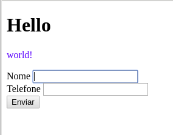

# Parte 5

Precisamos combinar persistência, requisições HTTP e servir documentos HTML com folhas de estilo (css) numa solução backend.

## Knex migrations

Esquemas de dados não são gravados em mármore. Uma nova coluna pode surgir, tabelas podem deixar de existir, novas aparecer.

Em mudando a percepção do negócio, fatalmente o esquema de dados mudará.

Gerenciar a mudança do esquema de dados é missão crítica de qualquer DBA e o desenvolvedor fullstack não é exceção.

Entra em cena o conceito de migração de esquema.

### Why migrates?

As mudanças na aplicação, como dissemos anteriormente, são motivadas por mudanças de negócio.

Entretanto, com a sepação existente entre aplicação e dados, nem sempre o esquema de dados pode ser versionado, como é feito com o código do aplicativo.

Arquivos de migração contém *patches* para o esquema de dados, alterando o banco para ficar alinhado com a mais recente mudança de negócio.

Uma nova versão do código do aplicativo trará um migrate *caso necessário*.

Com o knex podemos fazer uso de um sistema de migrações. Primeiro instale o knex a nível de sistema:

```bash
sudo npm -g install knex
```

**ATENÇÃO** no windows não tem sudo. *Em teoria* **npm -g install** basta.

Se você não tiver permissões de administrador na máquina, tente o seguinte:

- Crie um projeto que use o knex:

```bash
mkdir hello-js-se05-ep05
cd hello-js-se05-ep05
npm init -y
npm install knex sqlite3 --save
./node_modules/.bin/knex init
# ou ".\node_modules\.bin\knex init" se você estiver no windows
```

Isso cria um arquivo chamado **knexfile.js** com a seguinte estrutura:

```javascript
// Update with your config settings.

module.exports = {

  development: {
    client: 'sqlite3',
    connection: {
      filename: './dev.sqlite3'
    }
  },

  staging: {
    client: 'postgresql',
    connection: {
      database: 'my_db',
      user:     'username',
      password: 'password'
    },
    pool: {
      min: 2,
      max: 10
    },
    migrations: {
      tableName: 'knex_migrations'
    }
  },

  production: {
    client: 'postgresql',
    connection: {
      database: 'my_db',
      user:     'username',
      password: 'password'
    },
    pool: {
      min: 2,
      max: 10
    },
    migrations: {
      tableName: 'knex_migrations'
    }
  }

};
```

É importante que este arquivo esteja na raíz do projeto, pois o sistema de
migrações roda a partir do ponto de execução do node.

### Criando um migrate

Para criar um migrate, devemos usar o comando abaixo:

```bash
./node_modules/.bin/knex migrate:make esquema_inicial
# no windows .\node_modules\.bin\knex migrate:make esquema_inicial
```

- **migrate:make** é o parâmetro solicitando um novo migrate
- **esquema_inicial** é o nome que eu escolhi para este migrate. No knex, nome
  de migrate não pode conter espaços, por isso aquele underline ali

O resultado deste comando deve ser mais ou menos este:

```bash
Using environment: development
Knex:warning - sqlite does not support inserting default values. Set the `useNullAsDefault` flag to hide this warning. (see docs http://knexjs.org/#Builder-insert).
Created Migration: /home/sombriks/Documentos/hello-js-se05-ep05/migrations/20180130141837_esquema_inicial.js
```

Seu projeto deve estar organizado mais ou menos assim:

```bash
hello-js-se05-ep05
├── dev.sqlite3
├── knexfile.js
├── node_modules
│   └── uma ruma de pasta...
├── migrations
│   └── 20180130141837_esquema_inicial.js
├── package.json
└── package-lock.json
```

Os migrates residirão numa pasta chamada migrations. Quando solicitamos a
criação de um migrate, o knex nos entrega um arquivo com a seguinte estrutura:

```javascript
// migrations/20180130141837_esquema_inicial.js
exports.up = function(knex, Promise) {

};

exports.down = function(knex, Promise) {

};
```

#### Criando uma tabela com o knex migrations

Antes de aplicar o migrate no banco de dados, vamos escrever ele!

Na [documentação oficial do knex](http://knexjs.org/#Schema) tem tudo o que
podemos usar para criar, alterar ou remover estruturas de banco.

Vamos, neste migrate, criar uma tabela:

```javascript
// migrations/20180130141837_esquema_inicial.js
exports.up = knex => knex.schema.createTable("contato", tb => {
  tb.increments("idcontato")
  tb.string("nomecontato").notNullable()
  tb.timestamp("dtcriacaocontato").notNullable().defaultTo(knex.fn.now())
})

exports.down = function(knex, Promise) {
  return knex.schema.dropTable("contato")
};
```

Para aplicar este esquema no banco, use o seguinte comando:

```bash
./node_modules/.bin/knex migrate:latest
```

E a saída deve se parecer com esta:

```bash
Using environment: development
Knex:warning - sqlite does not support inserting default values. Set the `useNullAsDefault` flag to hide this warning. (see docs http://knexjs.org/#Builder-insert).
Batch 1 run: 1 migrations
/home/sombriks/Documentos/hello-js-se05-ep05/migrations/20180130141837_esquema_inicial.js
```

#### Inserindo dados com o knex migrations

Além de manipular o esquema de dados, podemos usar migrações para fazer carga
inicial de dados. Suponha o migrate abaixo:

```javascript
exports.up = knex => knex.schema
  .createTable("country", tb => {
    tb.increments("idcountry")
    tb.string("namecountry")
  }).createTable("state", tb => {
    tb.increments("idstate")
    tb.string("codestate")
    tb.string("namestate")
    tb.integer("idcountry").notNullable().references("country.idcountry")
  })

exports.down = knex => knex.schema
  .dropTable("state")
  .dropTable("country")
```

Num segundo migrate, podemos dar "carga" neste esquema:

```javascript
exports.up = knex => knex("country").insert({ idcountry: 1, namecountry: "Brasil" })

exports.down = knex => knex("country").del().where({ idcountry: 1 })
```

Num terceiro migrate:

```javascript
const estados = [
  { idcountry: 1, idstate: 1 , codestate: "AC", namestate: "Acre" },
  { idcountry: 1, idstate: 2 , codestate: "AL", namestate: "Alagoas" },
  { idcountry: 1, idstate: 3 , codestate: "AP", namestate: "Amapá" },
  { idcountry: 1, idstate: 4 , codestate: "AM", namestate: "Amazonas" },
  { idcountry: 1, idstate: 5 , codestate: "BA", namestate: "Bahia" },
  { idcountry: 1, idstate: 6 , codestate: "CE", namestate: "Ceará" },
  { idcountry: 1, idstate: 7 , codestate: "DF", namestate: "Distrito Federal" },
  { idcountry: 1, idstate: 8 , codestate: "ES", namestate: "Espírito Santo" },
  { idcountry: 1, idstate: 9 , codestate: "GO", namestate: "Goiás" },
  { idcountry: 1, idstate: 10 , codestate: "MA", namestate: "Maranhão" },
  { idcountry: 1, idstate: 11 , codestate: "MT", namestate: "Mato Grosso" },
  { idcountry: 1, idstate: 12 , codestate: "MS", namestate: "Mato Grosso do Sul" },
  { idcountry: 1, idstate: 13 , codestate: "MG", namestate: "Minas Gerais" },
  { idcountry: 1, idstate: 14 , codestate: "PA", namestate: "Pará" },
  { idcountry: 1, idstate: 15 , codestate: "PB", namestate: "Paraíba" },
  { idcountry: 1, idstate: 16 , codestate: "PR", namestate: "Paraná" },
  { idcountry: 1, idstate: 17 , codestate: "PE", namestate: "Pernambuco" },
  { idcountry: 1, idstate: 18 , codestate: "PI", namestate: "Piauí" },
  { idcountry: 1, idstate: 19 , codestate: "RJ", namestate: "Rio de Janeiro" },
  { idcountry: 1, idstate: 20 , codestate: "RN", namestate: "Rio Grande do Norte" },
  { idcountry: 1, idstate: 21 , codestate: "RS", namestate: "Rio Grande do Sul" },
  { idcountry: 1, idstate: 22 , codestate: "RO", namestate: "Rondônia" },
  { idcountry: 1, idstate: 23 , codestate: "RR", namestate: "Roraima" },
  { idcountry: 1, idstate: 24 , codestate: "SC", namestate: "Santa Catarina" },
  { idcountry: 1, idstate: 25 , codestate: "SP", namestate: "São Paulo" },
  { idcountry: 1, idstate: 26 , codestate: "SE", namestate: "Sergipe" },
  { idcountry: 1, idstate: 27 , codestate: "TO", namestate: "Tocantins" }
]

exports.up = knex => knex("state").insert(estados)

exports.down = knex => knex("country").del()
  .whereIn("idstate", estados.map(e => e.idstate))
```

Como migrates rodam, em produção, apenas uma vez, fazer carga de dados deste
modo é a forma segura de se fazer isso.

#### Excercício

- Crie o repositório e a pasta de projeto (hello-js-se05-ep05)
- Instale as dependências knex e sqlite3 no projeto npm
- Dê init no knex dentro do projeto npm
- Crie o migrate *esquema_inicial* mostrado no exemplo
- Use o *dbbrowser* para conferir o esquema criado
- Crie um novo migrate chamado add_contato_telefone
- Este migrate deverá **alterar** a tabela **contato** adicionando a coluna
  **telefone**. Leia a documentação do knex para saber como faz isso
- Execute este segundo migrate para adicionar a coluna à tabela
- Faça um migrate adicional para carregar três pessoas no banco. chame-o de
  carga_inicial
- Use o *dbbrowser* para conferir se a tabela tem uma nova coluna

#### Sobre o UP e DOWN de um esquema de dados

Estas duas funções exportadas pelo arquivo de migração servem para "fazer"
e para "desfazer" a migração de banco.

Em fase de desenvolvimento, é bastante útil fazer um "up", pra conferir como o
modelo de dados se comporta. Se não ficar como o esperado, basta fazer "down"
e modificar o arquivo de migração de forma adequada.

Em produção, entretanto, **não faz o menor sentido fazer um down do esquema**.
Dados podem ser perdidos. A alteração do esquema já foi consolidade as mais
distintas e imagináveis formas.

Adicionalmente, uma vez que um arquivo de migração rode em produção, é
recomendado **nunca mais exer nesse arquivo**.

## Combinando knex, knex migrations e express

Com o [express](http://expressjs.com), conforme vimos anteriormente, podemos
atender requisições HTTP.

Estas requisições farão consultas ao banco de dados utilizando o knex.

Por fim, apresentaremos o resultado da consulta no navegador, do modo que foi
feito quando consumimos uma api pública.

### Adicionando o express

```bash
cd hello-js-se05-ep05
npm install express morgan --save
touch index.js
```

Este script **index.js** combinará express com knex. *O que é esse morgan?*

```javascript
// index.js
const cfg = require("./knexfile")
const knex = require("knex")(cfg.development)
const express = require("express")
const morgan = require("morgan")
const app = express()

app.use(morgan("dev"))

app.get("/listcontatos", (req, res) => {
  knex("contato").select().then(ret => {
    res.send(ret)
  }).catch(err => {
    res.status(500).send(err)
    console.log(err)
  })
})
app.get("/addcontato", (req, res) => {
  knex("contato").insert(req.query, "idcontato").then(ret => {
      res.send(ret)
  }).catch(err => {
    res.status(500).send(err)
    console.log(err)
  })
})

knex.migrate.latest().then(_ =>
  app.listen(3000, _ =>
    console.log("server online!")))
```

Sobre este script:

- O [morgan](https://github.com/expressjs/morgan) é uma ferramenta de coleta
  de mensagens de log. Mensagens de log são importantes para analisar o
  funcionamento da aplicação
- Usamos duas rotas, uma para listar e uma para inserir. Nenhuma está bonita
  ainda
- Antes de subir o servidor na porta 3000, chamamos o sistema de migração do
  knex de modo a garantirmos que o banco está com o esquema mais recente.

## Arquivos estáticos com express

- Nem só de dados dinâmicos vive a web
- o express também é capaz de servir arquivos

Crie no seu projeto uma pasta chamada public e dentro dela coloque um arquivo
de texto:

```bash
cd hello-js-se05-ep05
mkdir public
echo "Olá estático" >> public/hello.txt
```

Modifique o index.js para inicar que a pasta public servirá arquivos:

```javascript
// index.js
const cfg = require("./knexfile")
const knex = require("knex")(cfg.development)
const express = require("express")
const morgan = require("morgan")
const app = express()

app.use(express.static("public"))

app.use(morgan("dev"))

app.get("/listcontatos", (req, res) => {
  knex("contato").select().then(ret => {
    res.send(ret)
  }).catch(err => {
    res.status(500).send(err)
    console.log(err)
  })
})
app.get("/addcontato", (req, res) => {
  knex("contato").insert(req.query, "idcontato").then(ret => {
      res.send(ret)
  }).catch(err => {
    res.status(500).send(err)
    console.log(err)
  })
})

knex.migrate.latest().then(_ =>
  app.listen(3000, _ =>
    console.log("server online!")))
```

Podemos servir:
- texto
- imagem
- audio
- vídeo
- documentos
- ...

Não faz sentido, por exemplo, gerar um documento de termos de uso
dinamicamente. Basta servir o contrato em forma de pdf ou html.

Mais detalhes sobre a pasta estática do express na [documentação oficial](https://expressjs.com/en/4x/api.html#express.static) do express.

## HTML

Vamos falar da língua que deu estrutura à internet.

HyperText Markup Language

É markup porque se usa de marcações especiais para diferenciar a informação.

É hiper-texto porque os documentos escritos nesta linguagem tem links que
levam para outros documentos.

[Mais detalhes](https://en.wikipedia.org/wiki/HTML).

Exemplo de um documento HTML:

```html
<!DOCTYPE html>
<html>
  <head>
    <!-- Comentário -->
    <title>Hello World!</title>
  </head>
  <body>
    <h1>Hello</h1>
    <p style="color:blue">world!</p>
  </body>
</html>
```

As palavras entre "<" e  ">" são elementos ou tags.

O `<h1>` é a tag de "Título 1"

O `<p>` é a tag de "Parágrafo"

Elementos com "</" são fechamentos de tag.

Aquele `style="color:blue"` é um atributo. Elementos podem contar um ou mais
atributos.

O html é tolerante a falhas.

Isso não quer dizer que ele corrija seus erros, mas sim que ele tenta se
recuperar dele, nem sempre resultando no que você espera.

### Exercício

**Crie um documento chamado index.html e sirva-o através da pasta de arquivos**
**estáticos do express.**

Você deve encontrar este documento em http://127.0.0.1:3000/index.html

### Formulários

Servir um documento html é bacana.

Mas usar um documento html para colher dados do usuário é muito mais legal.

Para tanto, é preciso construir um formulário.

Modifique o documento html criado (*public/index.html*):

```html
<!DOCTYPE html>
<html>
  <head>
    <!-- Comentário -->
    <title>Hello World!</title>
  </head>
  <body>
    <h1>Hello</h1>
    <p style="color:blue">world!</p>
    <form method="POST" action="addcontato">
      <label>
        Nome
        <input name="nomecontato" required/>
      </label>
      <br/>
      <label>
        Telefone
        <input name="telefonecontato" required/>
      </label>
      <br/>
      <input type="submit"/>
    </form>
  </body>
</html>
```

O resultado deve ser parecido com este abaixo:



O **required** é um atributo válido, embora não tenha a parte de definir valor.
Atributos assim são considerados atributos booleanos. Se estiverem lá, o valor
é `true`.

Observe que o atriuto **method** do formulário define o verbo HTTP a ser usado.
Nossa configuração de rotas, entretanto, não atende este verbo ainda.

Para tratar os dados a receber, adicione mais um plugin ao express:

```bash
cd hello-js-se05-ep05
npm i body-parser --save
```

Em seguida, modifique o **index.js** para receber corretamente estes dados:

```javascript
// index.js
const cfg = require("./knexfile")
const knex = require("knex")(cfg.development)
const express = require("express")
const morgan = require("morgan")
const bodyParser = require("body-parser")
const app = express()

app.use(express.static("public"))

app.use(morgan("dev"))

app.user(bodyParser.urlencoded())

app.get("/listcontatos", (req, res) => {
  knex("contato").select().then(ret => {
    res.send(ret)
  }).catch(err => {
    res.status(500).send(err)
    console.log(err)
  })
})

app.post("/addcontato", (req, res) => {
  const contato = req.body
  knex("contato").insert(contato, "idcontato").then(ret => {
      res.send(ret)
  }).catch(err => {
    res.status(500).send(err)
    console.log(err)
  })
})

knex.migrate.latest().then(_ =>
  app.listen(3000, _ =>
    console.log("server online!")))
```
O [body-parser](https://github.com/expressjs/body-parser#bodyparserurlencodedoptions)
oferece diversos meios de tratar os dados de payload das requisições HTTP.

Dos verbos mais comuns, temos:

- GET
- POST
- PUT
- DELETE

Destes, GET e DELETE não possuem payload. se precisarmos passar informação
via GET ou DELETE, devemos usar *path parameters* ou *query parameters*

O **POST** é, por convenção (*e portanto não se espante se ver diferente por aí*),
usado para inserir novos dados. Já o **PUT** faz as vezes de *update*

## CSS

O CSS (Cascading Style Sheet) serve para mudar a forma de apresentarmos um
documento de marcação.

No documento html de exemplo, usamos o atributo **style** para mudarmos a cor
do parágrafo.

Podemos definir estilos usando [os mais variados atributos](https://developer.mozilla.org/pt-BR/docs/Web/CSS/CSS_Reference).

Modifique mais uma vez o index.html:

```html
<!DOCTYPE html>
<html>
  <head>
    <!-- Comentário -->
    <title>Hello World!</title>
    <style>
      h1 {
        font-size:96px;
      }

      .bordado {
        border: 3px solid red;
        min-height: 100px;
        max-width: 300px;
      }

      #nome {
        border: 5px double blue;

      }
    </style>
  </head>
  <body>
    <h1>Hello</h1>
    <p>world!</p>
    <form class="bordado" method="POST" action="addcontato">
      <label>
        Nome
        <input id="nome" name="nomecontato" required/>
      </label>
      <br/>
      <label>
        Telefone
        <input name="telefonecontato" required/>
      </label>
      <br/>
      <input type="submit"/>
    </form>
  </body>
</html>
```

Podemos definir estilos dentro de tags `<style>`. É possível ainda adicionar
um **link** para um arquivo css:

```html
<!DOCTYPE html>
<html>
  <head>
    <title>Hello World!</title>
    <!-- o estilo vem de um arquivo externo agora -->
    <link rel="stylesheet" href="index.css"/>
  </head>
  <body>
    <h1>Hello</h1>
    <p>world!</p>
    <form class="bordado" method="POST" action="addcontato">
      <label>
        Nome
        <input id="nome" name="nomecontato" required/>
      </label>
      <br/>
      <label>
        Telefone
        <input name="telefonecontato" required/>
      </label>
      <br/>
      <input type="submit"/>
    </form>
  </body>
</html>
```

E o arquivo index.css ficaria:

```css
/* index.css */
h1 {
  font-size:96px;
}

.bordado {
  border: 3px solid red;
  min-height: 100px;
  max-width: 300px;
}

#nome {
  border: 5px double blue;

}
```

Criar estilos css demanda treinamento e percepção. Diferente da marcação, onde
um parágrafo é um parágrafo e um botão é um botão, estilos demandam estudos
visuais.

Para alguns profissionais isso vem naturalmente.

Para outros, estudo e trabalho duro, :-)

Felizmente, existem frameworks CSS prontos para usar.

Falaremos deles futuramente.

## Exercício

1. Modifique o projeto para contemplar o uso de um arquivo css externo
2. Crie usando knex migrations uma nova tabela chamada **produto**
3. Adicione uma rota para listar produtos. Use o verbo GET
4. adicione uma rota para inserir um produto. Use o verbo POST
5. Crie na pasta publica servida pelo express um documento html e salve-o
   como **index2.html**. Ele deve estar acessível em http://127.0.0.1:3000/index2.html
6. Leia a documentação sobre CSS e pinte o fundo do documento de preto e
   o texto (font-color) de branco.
7. Comite tudo e suba para o github. Não esquecer de colocar no .gitignore o
   que precisa ser ignorado.
