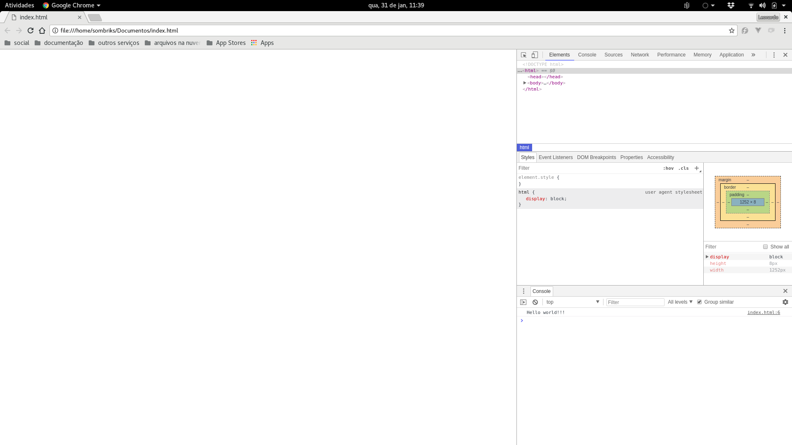
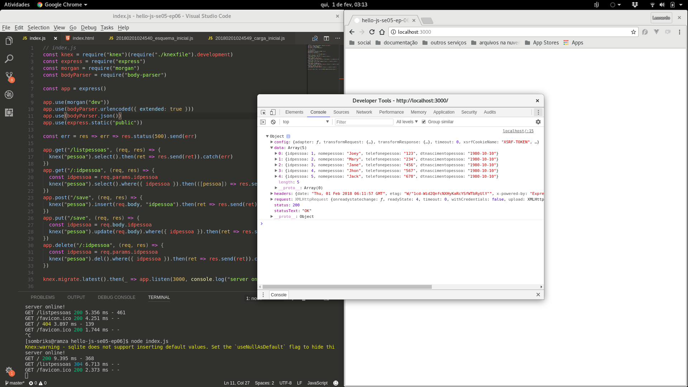
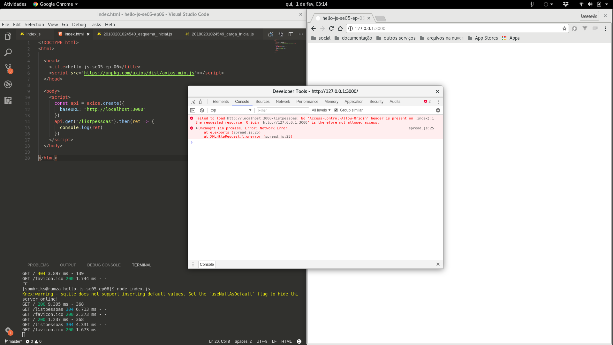
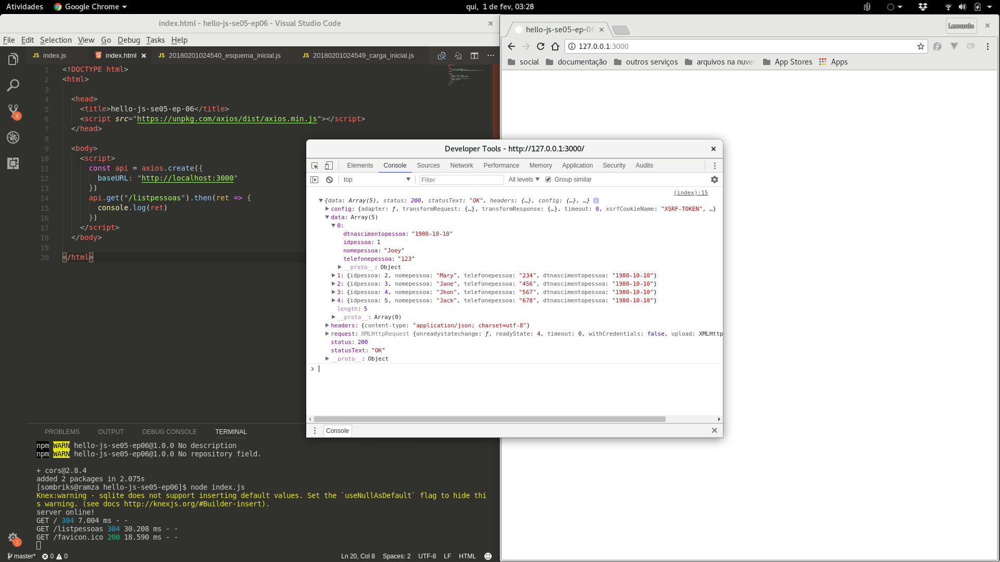

# Parte 6

Precisamos recepcionar os dados que chegam do servidor usando javascript para
compor dinamicamente a tela para apresentarmos os dados. Usaremos frameworks
de vanguarda para simplificarmos o processo de aquisição e apresentação dos
dados recuperados e também enviaremos dados para o backend usando estas mesmas
tecnologias front-end.

## Javascript no navegador de internet

Após 20 horas rodando javascript no lado do servidor, vamos voltar para onde a
linguagem nasceu.

Antes de rodar javascript no navegador, você precisa de uma tag de script no
seu documento HTML:

```html
<!DOCTYPE html>
<html>
  <body>
    <script>
      // index.html
      console.log("Hello world!!!")
    </script>
  </body>
</html>
```

Ao abrir este arquivo no navegador, o documento estará vazio. Mas se você inspecionar a página (`ctrl+shift+i`):



Observe que este inspetor oferece muitas outras coisas além de um console, mas trataremos delas adiante.

O javascript no browser está *embutido* (*embedded*), portanto não tem como
usar diretamente argumentos ou variáveis de ambiente nele.

### Manipulando a DOM

O javascript no browser pode, entretanto, manipular os elementos do documento
HTML. Modifique o index.html para exemplificarmos isso:

```html
<!DOCTYPE html>
<html>
  <body>
    <script>
      // index.html
      let i = 100
      while(i--) {
        const p = document.createElement("p")
        p.innerHTML=i
        document.body.appendChild(p)
      }
    </script>
  </body>
</html>
```

Nunca foi tão fácil fazer um documento de 99 parágrafos, ;-)

Assim como temos o process global no node, no javascript também temos alguns
objetos globais. o **document** é um deles. Ele nos dá acesso à àrvoce de
elementos do documento.

### Bibliotecas javascript através da internet

Assim como vimos no node, podemos usar bibliotecas no lado do navegador também.
Para tanto, basta incluirmos uma tag de script com o atributo **src**
apontando para a biblioteca que desjamos usar.

Exemplo:

```html
<!DOCTYPE html>
<html>
  <body>
    <ul id="catlist">
      <!-- dynamic content goes here -->
    </ul>
    <!-- https://cdnjs.com/libraries/axios -->
    <script type="text/javascript" src="https://cdnjs.cloudflare.com/ajax/libs/axios/0.17.1/axios.js"></script>
    <script>
      // index.html
      const api = axios.create({
        baseURL:"https://api.github.com"
      })
      // https://developer.github.com/v3/issues/#issues
      api.get("/repos/sombriks/hello-js-v5/issues").then(ret => {
        console.log(ret)
        ret.data.map(e => {
          const li = document.createElement("li")
          li.innerHTML = `<a href="${e.url}">${e.title}</a>`
          document.getElementById("catlist").appendChild(li)
        })
      }).catch(err => {
        console.log(err)
        const li = document.createElement("li")
        li.innerHTML = "erro!"
        document.getElementById("catlist").appendChild(li)
      })
    </script>
  </body>
</html>
```

Note que o uso do axios é o mesmo no browser e no servidor. Nem toda biblioteca
javascript é assim, mas é um bônus muito bem vindo sempre.

Se precisamos recuperar uma tag para usar no script, **document.getElementById**
é a função para a missão. A tag precisa, claro, ter um atributo **id** com um
valor único (que não se repita) no documento.

A tag de script que nos fornece o axios está num servidor externo. Esse tipo de
servidor, que fornece scripts e estilos css, chamamos de **CDN**, Content
Delivery Network.

Usar CDN's é vantajoso porque você pode testar muito rápido determinada solução ou experimentar uma biblioteca. Abaixo alguns serviços de CDN:

- [cdnjs](https://cdnjs.com)
- [jsdelivr](https://www.jsdelivr.com)
- [unpkg](https://unpkg.com)

A desvantagem é que sua aplicação fica dependente de um serviço de terceiro
para funcionar corretamente. Se, por exemplo, o [unpkg](https://unpkg.com/#/)
cair, e se você usar bibliotecas diretamente de lá, seu aplicativo cai junto.

### CDD e frameroks CSS

Você pode importar estilos bem trabalhados e elegantes usando os CDN's.
Abaixo um exemplo de como usar um framework CSS via CDN:

```html
<!DOCTYPE html>
<html>
  <head>
    <link rel="stylesheet" href="https://cdnjs.cloudflare.com/ajax/libs/bulma/0.6.2/css/bulma.min.css">
    <script type="text/javascript" src="https://cdnjs.cloudflare.com/ajax/libs/axios/0.17.1/axios.js"></script>
  </head>
  <!-- https://bulma.io/documentation/ -->
  <body class="box">
    <div class="tile is-ancestor is-vertical">
      <div class="tile notification is-primary">
        <p class="title">Issues</p>
      </div>
      <div class="tile notification is-primary">
          <ul id="catlist"></ul>
      </div>
    </div>
    <!-- https://cdnjs.com/libraries/axios -->
    <script>
      const api = axios.create({
        baseURL:"https://api.github.com"
      })
      // https://developer.github.com/v3/issues/#issues
      api.get("/repos/sombriks/hello-js-v5/issues").then(ret => {
        console.log(ret)
        ret.data.map(e => {
          const li = document.createElement("li")
          li.innerHTML = `<a href="${e.url}">${e.title}</a>`
          document.getElementById("catlist").appendChild(li)
        })
      }).catch(err => {
        console.log(err)
        const li = document.createElement("li")
        li.innerHTML = "erro!"
        document.getElementById("catlist").appendChild(li)
      })
    </script>
  </body>
</html>
```

No exemplo usamos um framework css chamado 
[bulma](https://bulma.io/documentation/overview/start/).

### Code snippets online

Estes serviços são ideais para você experimentar bibliotecas front-end e
dividir com as pessoas na internet. Você pode usar as bilbiotecas servidas
pelos CDN's para testar as coisas mais rapidamente online.

- [jsbin](https://jsbin.com)
- [jsfiddle](https://jsfiddle.net/)
- [codepen](https://codepen.io/)

## Exercício

1. Escolha um dos serviços de snippets e transporte o index.html para lá.
2. Distribua seu snippet comentando o link para ele na issue de presença.
3. Descubra, no serviço escolhido, como criar um link para o snippet criado.

## Introdução ao Vue.js

- Biblioteca fron-end para aplicações sofisticadas
- Reatividade transparente
- Simples
- Flexível, escala "para cima" e "para baixo"
  - CDN, NPM e integração com *bundlers* e ferramentas *cli*

Modifique o index.html:

```html
<!DOCTYPE html>
<html>
  <head>
    <title>Hello world vue</title>
    <script src="https://unpkg.com/vue/dist/vue.min.js"></script>
  </head>
  <body>
    <div id="mount">
      <h1>Hello, {{name}}</h1>
      <input v-model="name">
    </div>
    <script type="text/javascript">
      new Vue({
        el: "#mount",
        data: { name: "joe" }
      })
    </script>
  </body>
</html>
```

Diferente de antigamente, não precisamos explicar muita coisa sobre como
"grudar" uma variável numa interface. É o famoso [MVVM](https://en.wikipedia.org/wiki/Model%E2%80%93view%E2%80%93viewmodel).

Vários frameworks fazem isso, mas o vue é um dos mais simples de testar.

A reatividade transparente é o que permite você só informar que o atributo
javascript 'name' e lá no HTML o atributo de tag "v-model" resolver o resto.

## Exercício

Este exercício demanda tudo visto desde a aula 1.

1. Crie no **github** o projeto **hello-js-se05-ep06**
2. Faça um **clone** local
3. Dê **npm init** para criar o projeto
4. Instale como dependências **sqlite3, knex, express, morgan e body-parser**.
   Não esquecer o **--save** e nem o **.gitignore** para não subir a **node_modules**
5. Dê **knex init** neste projeto
6. Crie um migrate chamado **esquema_inicial**
7. Neste migrate, defina a criação de uma tabela de pessoas. A tabela deve
   conter um campo id, um campo nome, um campo telefone e um campo
   data de nascimento. não esquecer de desfazer a tabela no down do migrate
8. Crie um migrate chamado **carga_inicial**
9. Crie um insert de 5 pessoas
10. Crie um **index.js** para definirmos uma instãncia do **express**
    (*const app = express()*)
11. Adicione no express uma rota GET para listar pessoas (**"/listpessoas"**)
12. Adicione no express uma rota GET para recuperar pelo id (que deve chegar
    como variável de caminho (req.params)) exatamente uma pessoa, caso exista
13. Adicione no express uma rota POST para inserir novas pessoas. O insert
    deve retornar o id da pessoa recém-inserida no banco
14. Adicione no express uma rota PUT para fazer o update de pessoas existentes
15. Adicione no express uma rota DELETE que receba na url (req.params) o id da
    pessoa a ser removida, caso exista.
16. Garanta que os migrates rodarão antes do express entrar no ar
17. Crie uma pasta chamada **public**
18. Faça o express servir de modo estático o conteúdo desta pasta
19. Crie um arquivo chamado **index.html**

Feito o exercício poderemos seguir para a próxima parte

## Axios client-side

O axios no lado do browser, conforme apontamos, funciona igual ao lado do
servidor. Mas o browser, o navegador, possui limitações de segurança que o
lado do servidor não possui.

Exemplo: rode o index.js criado no exercício anterior. Em seguida, defina
dentro do index.html da pasta public o seguinte documento:

```html
<!DOCTYPE html>
<html>
  <head>
    <title>hello-js-se05-ep-06</title>
    <script src="https://unpkg.com/axios/dist/axios.min.js"></script>
  </head>
  <body>
    <script>
      const api = axios.create({
        baseURL:"http://localhost:3000"
      })
      api.get("/listpessoas").then(ret => {
        console.log(ret)
      })
    </script>
  </body>
</html>
```

- Visite http://localhost:3000/ e inspecione o documento HTML. A saída deve
  ser parecida com esta:



- Agora visite http://127.0.0.1:3000/ e inspecione o documento também. A saída
  deve ser parecida com esta:



- *Notou alguma diferença?*

### CORS

Seu código não está errado. Isto é uma política de segurança dos navegadores
chamada [SOP - Same Origin Policy](https://en.wikipedia.org/wiki/Same-origin_policy).
Em resumo o navegador rejeita dados que o javascript peça caso eles não venham
do mesmo servidor do documento HTML.

A boa notícia é que existe o [CORS - Cross-Origin Resource sharing](https://en.wikipedia.org/wiki/Cross-origin_resource_sharing).
Com o cors podemos liberar nosso servidor para fornecer dados para qualquer
destino ou para destinos seletos.

Para colocar o cors no express, instale o pacote npm a seguir e aplique-o no
**index.js** criado no exercício anterior:

```bash
cd hello-js-se05-ep06
npm install cors --save
```

```javascript
// index.js
const knex = require("knex")(require("./knexfile").development)
const express = require("express")
const morgan = require("morgan")
const bodyParser = require("body-parser")
const cors = require("cors")

const app = express()

app.use(cors())
app.use(morgan("dev"))
app.use(bodyParser.json()) // what's this? what's this?
app.use(bodyParser.urlencoded({ extended: true }))
app.use(express.static("public"))

const err = res => err => res.status(500).send(err)

app.get("/listapessoas", (req, res) => {
  knex("pessoa").select()
    .then(ret => res.send(ret)).catch(err)
})
app.get("/:idpessoa", (req, res) => {
  const idpessoa = req.params.idpessoa
  knex("pessoa").select().where({ idpessoa })
    .then(([pessoa]) => res.send(pessoa)).catch(err)
})
app.post("/save", (req, res) => {
  knex("pessoa").insert(req.body, "idpessoa")
    .then(ret => res.send(ret)).catch(err)
})
app.put("/save", (req, res) => {
  const idpessoa = req.body.idpessoa
  knex("pessoa").update(req.body).where({ idpessoa })
    .then(ret => res.send(ret)).catch(err)
})
app.delete("/:idpessoa", (req, res) => {
  const idpessoa = req.params.idpessoa
  knex("pessoa").del().where({ idpessoa })
    .then(ret => res.send(ret)).catch(err)
})

knex.migrate.latest()
  .then(_ => app.listen(3000, console.log("server online!")))

```

Após a alteração, mesmo com a origem diferente, devemos ser capazes de
recuperar os dados!



## Exercício axios client-side chamando server-side

1. Leia sobre como funciona o [v-for do vue](https://vuejs.org/v2/guide/list.html#Mapping-an-Array-to-Elements-with-v-for)
2. No **index.html** do exercício anterior, adicione um cdn que ofereça o vue
   em sua versão 2 mais recente
3. Leia sobre [created](https://vuejs.org/v2/api/#created) e [data](https://vuejs.org/v2/api/#Options-Data)
4. Dentro da seção created, consulte usando o **axios** a listagem de pessoas
5. A lista de pessoas recuperadas pelo axios deve ser atribuída a um valor na
   sessão data da instância do vue. Exemplo:
```javascript
// snippet de dentro do documento
new Vue({
  data:{
    lista:null
  },
  created(){
    api.get("/listapessoas")
      .then(ret => this.lista = ret.data)
  }
})
```
6. Usando o que você aprendeu sobre o **v-for**, crie uma [lista html](https://developer.mozilla.org/pt-BR/docs/Web/HTML/Element/ul)
para mostrar o nome das pessoas
7. Acima da lista, crie um formulário com três campos:
  - nome
  - telefone
  - nascimento
8. Nos atributos do formulário, em vez de action ou method, defina um
   atributo especial do vue, o [@submit.prevent](https://vuejs.org/v2/guide/events.html#Event-Modifiers).
9. Modifique o viewmodel para ter uma ação para este submit. Exemplo:
```html
<!-- resto do documento -->
<form @submit.prevent="dosave">
  <label><input v-model="pessoa.nomepessoa"/></label><br/>
  <label><input v-model="pessoa.telefonepessoa"/></label><br/>
  <label><input v-model="pessoa.dtnascimentopessoa"/></label><br/>
  <input type="submit"/>
</form>
<!-- resto do documento -->
```
```javascript
// resto do snippet de dentro do documento
new Vue({
  data:{
    lista:null,
    pessoa:{nome:"",}
  },
  created(){
    api.get("/listapessoas")
      .then(ret => this.lista = ret.data)
  },
  methods:{
    dosave(){
      // passo 10
    }
  }
})
// resto do snippet de dentro do documento
```
10. Leia a [documentação do axios](https://github.com/axios/axios#request-method-aliases) e veja como fazer um post
11. Verifique se os dados estão sendo salvos no banco.

Voilá!

Devemos ter um client-side consumindo duas chamadas distintas de API!

Como desafio extra fica a reorganização da instância do vue de modo que,
ao salvar uma pessoa, a lista de pessoas seja recarregada.
