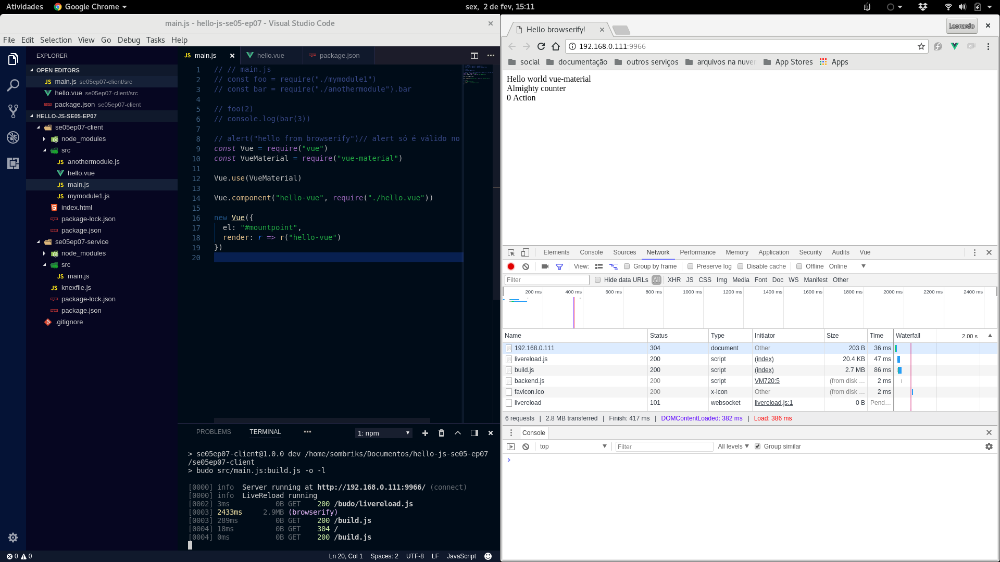
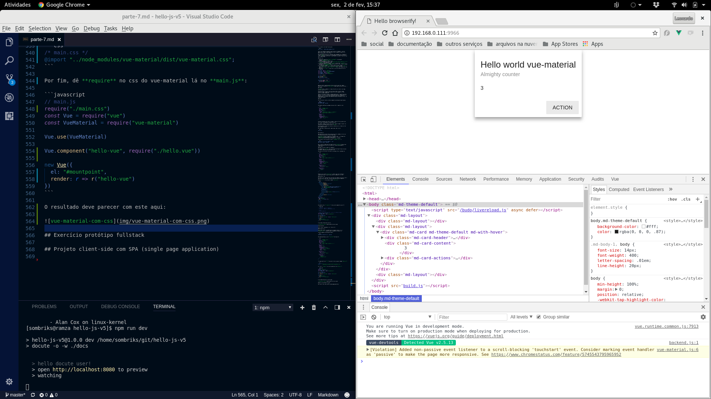

# Parte 7

- Precisamos diferir projeto de repositório, pois cada repo poderá conter mais
  de um projeto
- Precisamos automatizar o recarregamento dos scripts e assets
- Precisamos separar, a nível de projeto, cliente de serviço/servidor
- Precisamos de um toolkit de alto nível que resolva o CSS da aplicação cliente
- Precisamos nos aprofundar no vue e dominar o conceito de componente

## Browserify

- É um bundler, um "empacotador" de javascript para o lado do cliente
- Permite usar o exports/require como se estivéssemos no node
- Livra seu código dos problemas de namespace global que as tags de script
  sofrem ao tratar cada arquivo js como um módulo isolado
- Tenta disponibilizar as bibliotecas server side para o client side, quando
  compatíveis.

### Instalando

```bash
sudo npm -g install browserify
```

Se for um windows ou um linux onde vocẽ não tem poderes administrativos, use a
estratégia de instalar como dependência de projeto e use a partir da pasta .bin
dentro de node_modules (como foi feito com o knex):

```bash
mkdir sample
cd sample
npm init -y
npm install browserify --save-dev
```

O **package.json** deve ficar mais ou menos assim:

```json
{
  "name": "sample",
  "version": "1.0.0",
  "description": "",
  "main": "index.js",
  "scripts": {
    "test": "echo \"Error: no test specified\" && exit 1"
  },
  "keywords": [],
  "author": "",
  "license": "ISC",
  "devDependencies": {
    "browserify": "^15.2.0"
  }
}
```

Nota: o browserify só é necessário em tempo de desenvolvimento. O arquivo
resultante não depende dele. Por isso ele é salvo com **--save-dev**

### Uso básico

Teremos agora uma pasta **src** e dentro dela os módulos do projeto:

```bash
# na pasta sample
mkdir src
cd src
touch main.js
touch mymodule1.js
touch anothermodule.js
```

A estrutura deve se parecer com essa:

```bash
sample
├── node_modules
├── package.json
├── package-lock.json
└── src
    ├── anothermodule.js
    ├── main.js
    └── mymodule1.js
```

Nossas bibliotecas hipotéticas são módulos exportando alguma coisa, conforme
vimosanteriormente:

```javascript
// anothermodule.js
exports.bar = x => x * x * x
```

```javascript
// mymodule1.js
module.exports = x => console.log(x * x)
```

O main.js faz as vezes de "ponto de entrada" (i.e. aquele script que era
passado para o node. *Mas aqui não tem node*):

```javascript
// main.js
const foo = require("./mymodule1")
const bar = require("./anothermodule").bar

foo(2)
console.log(bar(3))
```

Agora é só voltar pro console e usar o browserify para "empacotar" tudo:

```bash
browserify src/main.js -o build.js
```

Lembrando que, no caso do windows, o browserify está em
**.\node_modules\.bin\browserify**

## Exercício de build com browserify

1. Crie pelo **github** o repositório **hello-js-se05-ep07**
2. Faça checkout
3. Dentro da pasta do repositório, crie uma pasta chamada **se05ep07-client**
4. Entre nesta pasta e dê **npm init -y** nela.
5. Crie um **index.html** dentro de *se05ep07-client* com a seguinte estrutura:
```html
<!DOCTYPE html>
<html>
<head>
  <title>Hello browserify!</title>
</head>
<body>
  <div id="mountpoint"></div>
  <script src="build.js"></script>
</body>
</html>
```
6. Crie uma pasta **src** e dentro dela crie um arquivo chamado **main.js**
7. Modifique no **package.json** a sessão de scripts. Deve ficar mais ou menos assim:
```json
{
  "name": "se05ep07-client",
  "version": "1.0.0",
  "description": "",
  "main": "build.js",
  "scripts": {
    "build": "browserify src/main.js -o build.js"
  },
  "keywords": [],
  "author": "",
  "license": "ISC",
  "devDependencies": {
    "browserify": "^15.2.0"
  }
}
```
8. Experimente fazer o build do projeto através do script criado:
```bash
npm run build
```
9. No **main.js** adicione a seguinte linha de javascript: 

```javascript
// main.js
const foo = require("./mymodule1")
const bar = require("./anothermodule").bar

foo(2)
console.log(bar(3))

alert("hello from browserify")// alert só é válido no browser
```

## Projeto fullstack com browserify

Daqui por diante, **a raíz do repositório não é mais a raíz do projeto**.

O repositório contará com dois projetos distintos: um "-client" e um "-service".

Esta separação é benéfica, pois embora seja possível usar a pasta static do
express para servir recursos para o navegador, a ideia de um projeto dentro do
outro deve ser evitada enquanto possível.

Adicionalmente, se usássemos o npm dentro da pasta static, teríamos problemas
para não se perder entre os artefatos. *Onde é servidor? Onde é cliente?*

Mantendo os dois projetos, frontend e backend, dentro do mesmo repositório
git, entretanto, sugere para quem baixa o repositório que, em teoria, aquela
versão do cliente é compatível com aquela versão do serviço.

## Budo e nodemon

Um dos passos mais aborrecidos no dia a dia de um desenvolvedor é testar as
alterações de código ao vivo.

O ciclo alterar - recarregar - visualizar é responsável, muitas vezes, por
30% do tempo gasto escrevendo uma nova feature.

Há tecnologias, inclusive, que os servidores levam até 3 minutos para mostrar
o resultado da alteração.

No node, felizmente, levamos apenas alguns segundos, mas queremos melhor,
queremos mais.

### Seção scripts do package.json

Antes de usarmos os reloaders, vamos tratar de uma técnica essencial para isso
tudo funcionar.

Vimos no exercício anterior um jeito de usar o package.json para guardar o
comando de empacotamento do browserify.

A seção de scripts serve para rodar comandos. A diferença é que os comandos
dentro da seção de scripts tem direito àquela pasta **.bin** que fica
escondida dentro da **node_modules**.

Por exemplo, se eu quiser colocar a chamada do **knex** num **package.json**,
ficaria assim:

```json
{
  "name": "se05ep07-service",
  "version": "1.0.0",
  "description": "",
  "main": "src/main.js",
  "scripts": {
    "knex": "knex",
    "dev": "nodemon src/main.js"
  },
  "keywords": [],
  "author": "",
  "license": "ISC",
  "dependencies": {
    "body-parser": "^1.18.2",
    "cors": "^2.8.4",
    "express": "^4.16.2",
    "knex": "^0.14.2",
    "morgan": "^1.9.0",
    "sqlite3": "^3.1.13"
  },
  "devDependencies": {
    "nodemon": "^1.14.11"
  }
}
```

E o uso deste script npm ficaria assim:

```bash
npm run knex -- migrate:make esquema_inicial
```

Como o knex depende de argumentos para funcionar corretamente, é preciso
passar um "--" (dois traços) para indicar que os argumentos seguintes são
para o programa que o script invoca.

Outro ponto muito valioso a ser indicado é que o package.json é um arquivo no
formato [JSON](https://www.json.org) no modo mais estrito possível. Não dá
inserir comentários e nem colocar vírgulas demais ou de menos. Chaves precisam
ser strings válidas.

### Exercício

1. Na pasta do repositório **hello-js-se05-ep07** crie uma pasta
   chamada **se05ep07-service**
2. Entre nessa pasta e dê npm init nela.
3. Instale as dependências server-side **sqlite knex express body-parser cors**
   **morgan** e não esqueça do --save
4. Instale uma dependência chamada **nodemon** e salve com **--save-dev**
5. modifique o **package.json** para ter na seção de scripts o knex e o nodemon
   conforme visto *no exemplo anterior*
6. Crie uma pasta chamada **src** e dentro dela um arquivo chamado **main.js**
7. Dê um **npm run knex -- init** na raíz do **projeto** service.
   Não confundir com a raíz do **repositório**. Não dar esse comando dentro da
   pasta src.
8. Modifique o **src/main.js** para conter o a estrutura básica do serviço
```javascript
// src/main.js
const cfg = require("../knexfile")
const knex = require("knex")(cfg.development)
const express = require("express")
const morgan = require("morgan")
const bodyParser = require("body-parser")

const app = express()

app.use(morgan("dev"))
app.use(bodyParser.json())

// Vamos adicionar rotas depois

knex.migrate.latest().then(_ => {
  app.listen(3000, _ => {
    console.log("server online")
  })
})
```

Daqui por diante, quando quisermos rodar um projeto javascript, sempre
digitaremos no console um **npm run dev** e vamos esperar que tudo funcione :-)

### nodemon

O [nodemon](https://nodemon.io/) vigia alterações nos scripts e recarrega
sozinho o seu serviço.

Em vez de alterar o script, voltar ao console, matar o script e chamar
novamente, chame o nodemon uma vez que ele fica recarregando os scripts
por você de modo transparente.

Lembre-se, entretanto, de matar o nodemon quando estiver criando arquivos de
migração. Se vocẽ criar um arquivo de migração enquanto o nodemon estiver em
operação, e se o seu serviço tiver aquele gancho pra rodar as migrações
automaticamente, ele tentará rodar migrações vazias no seu banco, e isso é um
grande aborrecimento.

### budo

Entre no projeto cliente e instale a dependência de desenvolvimento abaixo:

```bash
cd se05ep07-client
npm install budo --save-dev
```

Em seguida, modifique seu package.json para conter o seguinte script:

```json
{
  "name": "se05ep07-client",
  "version": "1.0.0",
  "description": "",
  "main": "build.js",
  "scripts": {
    "build": "browserify src/main.js -o build.js",
    "dev": "budo src/main.js:build.js -o -l"
  },
  "keywords": [],
  "author": "",
  "license": "ISC",
  "devDependencies": {
    "browserify": "^15.2.0",
    "budo": "^11.0.1"
  }
}
```

De maneira análoga ao que vimos no nodemon, o budo verifica as modificações 
nos scripts, nos documentos e arquivos de estilo.

Na verdade o nodemon faz umas coisas a mais, como por exemplo "inventar" um
index.html, mas falamos disso no futuro. *Ou não*.

Do mesmo modo que criamos um script dev no lado do serviço, temos um script 
dev no lado do cliente.

Não importando o tipo de projeto, sempre vamos rodar ele com:

```bash
npm run dev
```

## vue-material

Agora que nossos projetos tem um ensaio de estrutura, podemos arriscar usar 
tecnologias que procuram nos salvar algum tempo.

O [vue-material](https://vuematerial.io/components/app) é um framework de 
componentes vue que implementa a especificação 
[material design](https://material.io/guidelines/) do google.

Para instalar, entre no projeto cliente (**se05ep07-client**) e:

```bash
npm install vue vue-material@0.8.1 --save
npm install vueify --save-dev
```

Nota: estamos forçando uma versão específica do *vue-material* porque a mais 
recente, na época de construção do material, estava com problemas de 
estabilidade.

### Render function e single file components

Essa dependência **vueify** é uma transformação do browserify que serve para 
carregarmos componentes especializados do vue.

Para que ele surta efeito, entretanto, precisamos alterar o package.json:

```json
{
  "name": "se05ep07-client",
  "version": "1.0.0",
  "description": "",
  "main": "index.js",
  "scripts": {
    "dev": "budo src/main.js:build.js -o -l"
  },
  "keywords": [],
  "author": "",
  "license": "ISC",
  "devDependencies": {
    "browserify": "^15.2.0",
    "budo": "^11.0.1",
    "vueify": "^9.4.1"
  },
  "dependencies": {
    "vue": "^2.5.13",
    "vue-material": "^0.8.1"
  },
  "browserify":{
    "transform":[
      "vueify"
    ]
  }
}
```

Devemos criar a seção **"broserify"** e indicar uma lista com todas as 
transformações que o browserify deve aplicar ao empacotar os scripts.

#### Arquivos .vue

Um arquivo .vue é um arquivo que contém uma seção template, uma seção script e
uma seção style. Tudo o que é necessário para definirmos um componente.

Na pasta **src** crie um arquivo chamado **hello.vue**:

```html
<template>
  <md-layout md-gutter>
    <md-layout md-gutter></md-layout>
    <md-layout md-gutter>
      <md-card md-with-hover>
        <md-card-header>
          <div class="md-title">Hello world vue-material</div>
          <div class="md-subhead">Almighty counter</div>
        </md-card-header>
        <md-card-content>
          {{counter}}
        </md-card-content>
        <md-card-actions>
          <md-button @click="counter++">Action</md-button>
        </md-card-actions>
      </md-card>
    </md-layout>
    <md-layout md-gutter></md-layout>
  </md-layout>
</template>
<script>
module.exports = {
  name: "HelloVue",
  data: _ => ({ counter: 0 })
};
</script>
<style>

</style>
```

Em seguida, abra o **src/main.js** e faça uso do componente vue por lá:

```javascript
// // main.js
// const foo = require("./mymodule1")
// const bar = require("./anothermodule").bar

// foo(2)
// console.log(bar(3))

// alert("hello from browserify")// alert só é válido no browser
const Vue = require("vue")
const VueMaterial = require("vue-material")

Vue.use(VueMaterial)

Vue.component("hello-vue", require("./hello.vue"))

new Vue({
  el: "#mountpoint",
  render: r => r("hello-vue")
})
```

O resultado será parecido com este:



O que aconteceu?

Se você disser "esquecemos o css", disse certo!

#### browserify-css

Assim como o vueify é necessário para carregarmos arquivos .vue, o 
**browserify-css** é necessário para carregarmos os arquivos css.

Instale a dependência de desenvolvimento:

```bash
npm install browserify-css --save-dev
```

Em seguida modifique a seção **transform** do browserify:

```json
{
  "name": "se05ep07-client",
  "version": "1.0.0",
  "description": "",
  "main": "index.js",
  "scripts": {
    "dev": "budo src/main.js:build.js -o -l"
  },
  "keywords": [],
  "author": "",
  "license": "ISC",
  "devDependencies": {
    "browserify": "^15.2.0",
    "browserify-css": "^0.14.0",
    "budo": "^11.0.1",
    "vueify": "^9.4.1"
  },
  "dependencies": {
    "vue": "^2.5.13",
    "vue-material": "^0.8.1"
  },
  "browserify": {
    "transform": [
      "vueify",
      "browserify-css"
    ]
  }
}
```

Crie agora dentro de **src** do projeto client um arquivo chamado **main.css**:

```css
/* main.css */
@import "../node_modules/vue-material/dist/vue-material.css";
```

Por fim, dê **require** no css do vue-material lá no **main.js**:

```javascript
// main.js
require("./main.css")
const Vue = require("vue")
const VueMaterial = require("vue-material")

Vue.use(VueMaterial)

Vue.component("hello-vue", require("./hello.vue"))

new Vue({
  el: "#mountpoint",
  render: r => r("hello-vue")
})
```

O resultado deve parecer com este aqui:



#### Render function

A render function passou bem discreta ali dentro da definição do view-model.

É ela quem pega os três pedaços distintos dos arquivos .vue e transforma em
conteúdo HML normal. É ela quem encontra um `<md-button>` e busca o componente
vue que define isso.

Vários outros frameworks possuem o conceito de render function.

Você pode passar como argumento tanto o nome de um componente registrado quanto
um *require* para um. o main.js também funciona assim:

```javascript
// main.js
require("./main.css")
const Vue = require("vue")
const VueMaterial = require("vue-material")

Vue.use(VueMaterial)

new Vue({
  el: "#mountpoint",
  render: r => r(require("./hello.vue"))
})
```

## Projeto client-side com SPA (single page application)

Um aplicativo completo precisará pode fazer bom uso de esquemas de navegação.

Suponha um sistema de festas e convidados. 
- Poderemos:
  - listar festas
  - listar convidados
  - criar festa
  - criar convidado
  - indicar quais convidados irão a quais festas

Usando as habilidades de modelagem de banco e o knex, podemos realizar um 
esquema que atenda essa necessidade.

Usando o vue e o axios podemos criar 5 componentes que consultem o serviço 
criado com express e assim gerir festas, convidados e convites.

Usando o vue-router podemos navegar por entre estes componentes.

O vue-router é o que possibilita organizarmos estes componentes em uma **SPA**.

SPA significa **Single Page Application**

É basicamente mais um truque para não recarregarmos a página.

no projeto cliente instale o vue-router:

```bash
cd se05ep07-client
npm install vue-router --save 
```

Em seguida, crie um componente vue para gerir as rotas. Chame-o de **spa.vue**:

```html
<template>
  <div>
    <h1>BALADA VUE</h1>
    <router-view></router-view>
  </div>
</template>

<script>
const VueRouter = require("vue-router");

module.exports = {
  name: "Spa",
  router: new VueRouter({
    routes: [
      { path: "/lista-festas", component: require("lista-festas.vue") },
      { path: "/criar-festa", component: require("criar-festa.vue") }
    ]
  })
};
</script>

<style>

</style>
```

Nota: aquela div é necessária porque os templates dos documentos .vue só podem 
ter um elemento raíz.

No main.js é preciso fazer o *install* do VueRouter:

```javascript
// main.js
require("./main.css")

const Vue = require("vue")
const VueRouter = require("vue-router")
const VueMaterial = require("vue-material")

Vue.use(VueRouter)
Vue.use(VueMaterial)

new Vue({
  el: "#mountpoint",
  render: r => r(require("./hello.vue"))
})
```

Nas rotas do *spa.vue* indicamos dois componentes. Vamos criar os dois:

```html

```

```html

```


## Exercício protótipo fullstack

